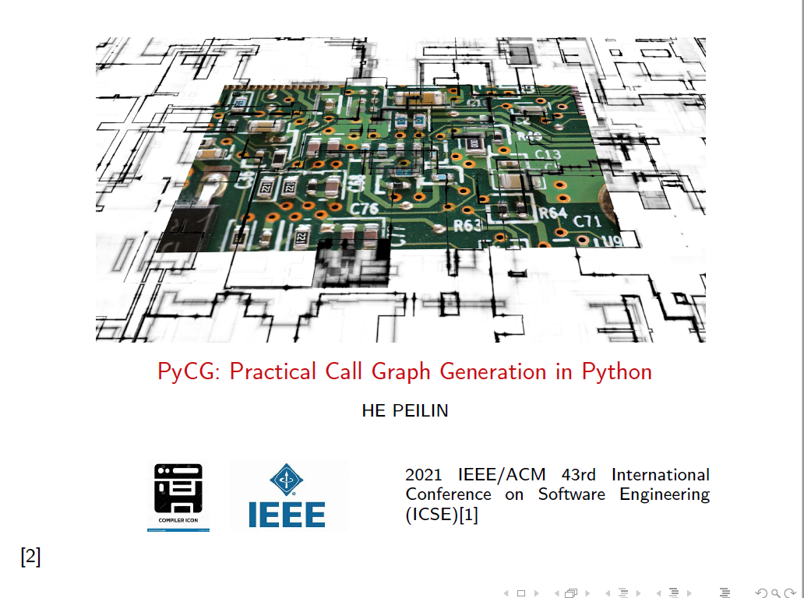
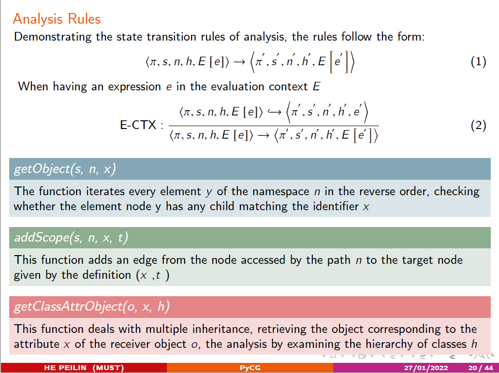
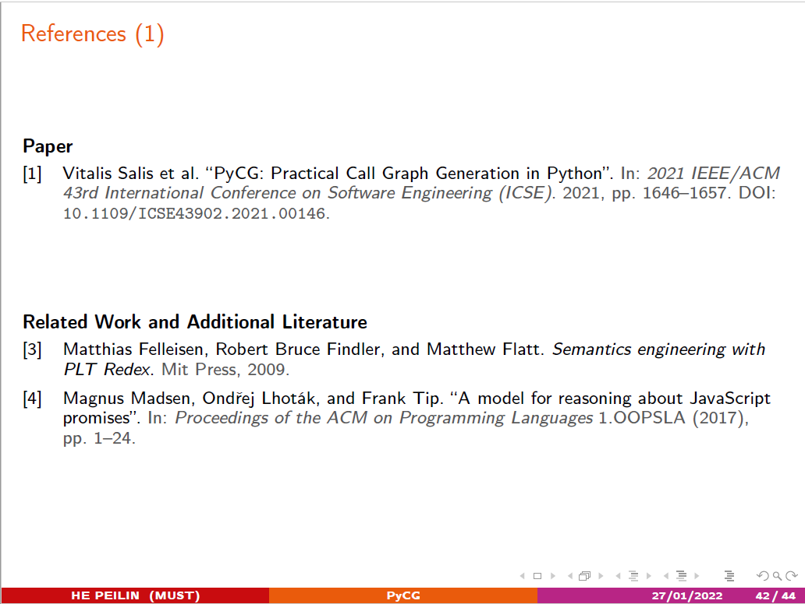

# Beamer-template for paper presentation 
---------------------------------------------
## Example Slides







the PDF file [beamer](./beamer.pdf)
## Paper cite
```bibtex
@INPROCEEDINGS{9402076,
  author={Salis, Vitalis and Sotiropoulos, Thodoris and Louridas, Panos and Spinellis, Diomidis and Mitropoulos, Dimitris},
  booktitle={2021 IEEE/ACM 43rd International Conference on Software Engineering (ICSE)}, 
  title={PyCG: Practical Call Graph Generation in Python}, 
  year={2021},
  volume={},
  number={},
  pages={1646-1657},
  doi={10.1109/ICSE43902.2021.00146},
  keywords={inf}
}
```
corresponding github repository : https://github.com/vitsalis/pycg

## Acknowledge
Parts of template have been borrowed from the following repositories:
- [th-koeln-beamer-template](https://github.com/drocheam/th-koeln-beamer-template)
